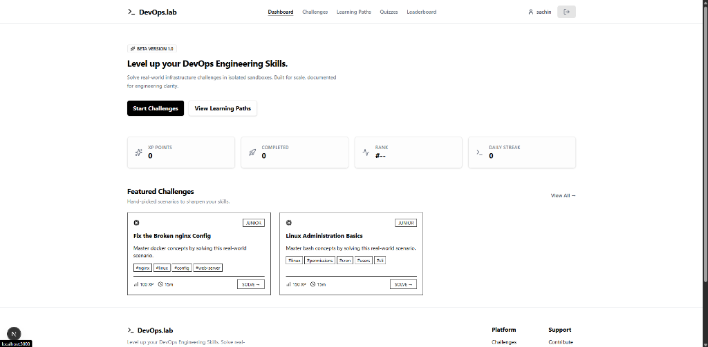
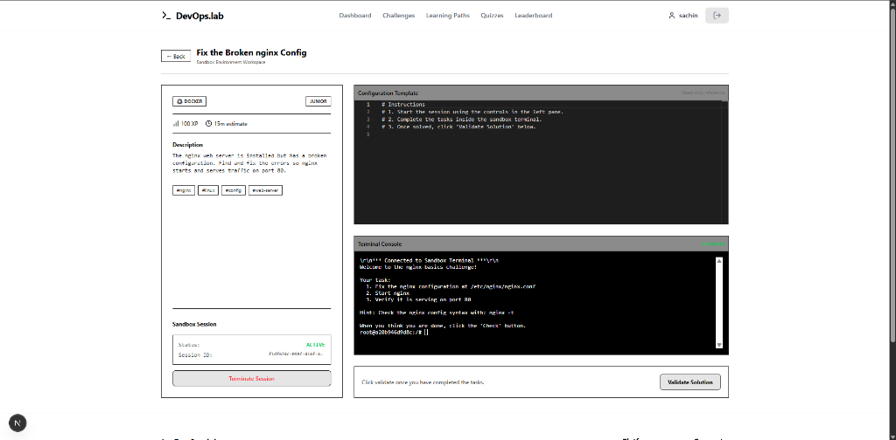
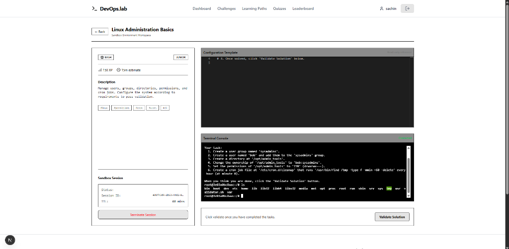

# DevOps.lab

DevOps.lab is a learning platform for practicing DevOps and infrastructure troubleshooting in isolated, interactive sandboxes.

## Sandboxing Architecture
We moved away from Firecracker microVMs in favor of Docker containers secured via gVisor (`runsc`). This allows standard Linux commands to run natively, speeds up container start times, and simplifies local socket management.

## Screenshots

### Dashboard

### Example 1: Web Server Troubleshooting
Configure and troubleshoot a live, broken nginx environment inside the interactive web terminal with instant validation.

### Example 2: System Administration
Learn to manage user groups, directory permissions, ownership (UID/GID), and configure system cron jobs.

## Stack
- **Next.js**: Frontend client with xterm.js terminal and Monaco editor.
- **Kong API Gateway**: Ingress proxy, authentication routing, and rate limiting.
- **Go / Node.js**: Challenge, sandbox, progress, and notification services.
- **PostgreSQL / Redis**: Datastore, caching, and state management.
- **Kafka / RabbitMQ**: Event bus and task dispatch queues.
