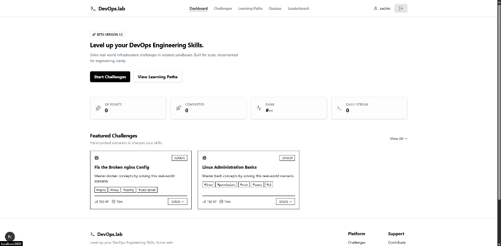
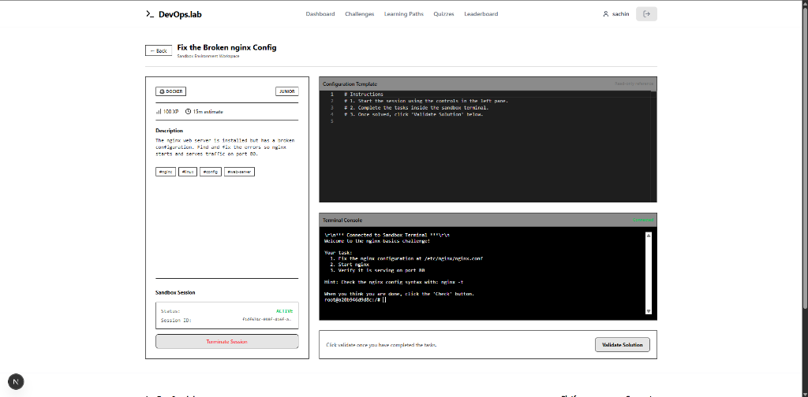
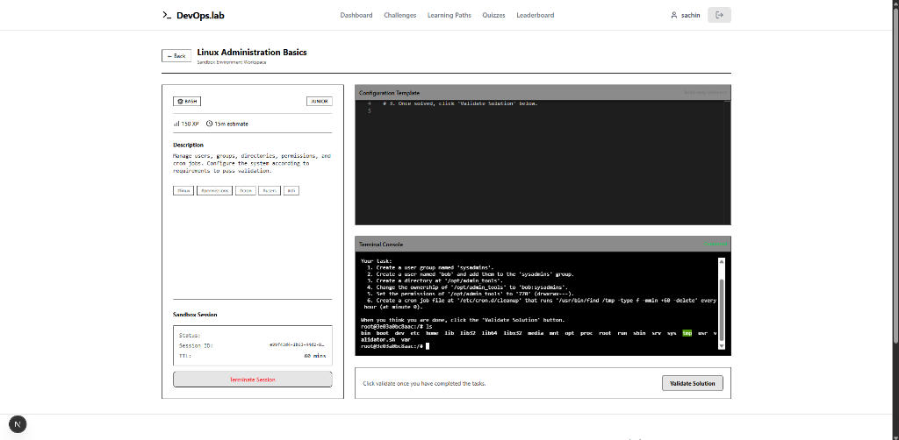

# DevOps.lab

> An interactive learning platform for practicing DevOps and infrastructure troubleshooting in isolated, real-world sandboxes — not simulations.

Users authenticate, pick a challenge (broken nginx, misconfigured Kubernetes, faulty CI pipeline), and get dropped into a live terminal inside an isolated execution environment. The platform supports multiple pluggable sandbox runtimes with progressive isolation levels:
- **Standard Docker**: Fast startup, host-native container isolation (`no-new-privileges`, `CapDrop: ALL`).
- **gVisor (`runsc`)**: Application-level kernel sandboxing intercepting guest syscalls.
- **Kata Containers (`kata-fc` / `kata-qemu`)**: MicroVM isolation per container backed by Firecracker or QEMU.
- **Flintlock MicroVMs**: Direct gRPC-driven Firecracker MicroVMs provisioned via OCI container sources with SSH/PTY bridges.

Learners troubleshoot the issue in a live interactive terminal, hit "Check", and a validator script inside the guest container/microVM grades their work in real-time.

---

## Architecture at a Glance

```
┌─────────────────────────────────────────────────────────────────────────┐
│                          Client Browser                                 │
│                                                                         │
│  Next.js Frontend (xterm.js terminal + Monaco editor)                   │
│                           │                                             │
└───────────────────────────┼─────────────────────────────────────────────┘
                            │ HTTP / WebSocket
                            ▼
                 ┌─────────────────────┐
                 │   Kong API Gateway   │  Rate limiting via Redis
                 │       (Edge)         │  Route-based auth enforcement
                 └──────┬──────┬───────┘
                        │      │
           ┌────────────┘      └────────────┐
           ▼                                ▼
┌─────────────────────┐          ┌─────────────────────┐
│   Auth Service       │          │   Core Service       │
│   (Node.js / TS)     │          │   (Node.js / TS)     │
│                      │          │                      │
│ • OAuth (Google/GH)  │          │ • Challenge catalog  │
│ • RS256 JWT + JTI    │          │ • Session lifecycle   │
│ • MFA (TOTP)         │          │ • Leaderboards / XP  │
│ • Outbox → Kafka     │          │ • B2B Orgs / RBAC   │
└─────────┬────────────┘          │ • Outbox → Kafka +  │
          │                       │   RabbitMQ           │
          │                       └──────────┬───────────┘
          │                                  │
          │            ┌─────────────────────┤
          │            │ RabbitMQ             │ Kafka
          │            ▼                     ▼
          │  ┌─────────────────────┐  ┌─────────────────────┐
          │  │  Sandbox Worker     │  │ Notification Service │
          │  │  (Go)               │  │ (Node.js / TS)       │
          │  │                     │  │                      │
          │  │ • Docker container  │  │ • Kafka consumer     │
          │  │   provisioning      │  │ • RabbitMQ consumer  │
          │  │ • WebSocket/PTY     │  │ • Transactional      │
          │  │   via tmux          │  │   email (Resend)     │
          │  │ • Validator exec    │  └──────────────────────┘
          │  └─────────────────────┘
          │
          ▼
    ┌──────────┐   ┌───────┐
    │ Postgres │   │ Redis │   Shared by all services
    └──────────┘   └───────┘
```

---

## Monorepo Layout

```
devops-learning-platform/
├── apps/
│   └── web/                    # Next.js frontend (xterm.js, Monaco, Turbopack)
├── services/
│   ├── auth/                   # Authentication, OAuth, MFA, session management
│   ├── core/                   # Challenges, content, sessions, orgs, leaderboard
│   ├── notification/           # Event-driven email dispatch (Kafka + RabbitMQ)
│   └── sandbox/                # Go service — container provisioning, WebSocket PTY, validation
├── packages/
│   ├── db/                     # Shared Prisma schema, client, and migrations
│   ├── messaging/              # Kafka producer/consumer + RabbitMQ publisher/consumer wrappers
│   ├── observability/          # OpenTelemetry tracing + Pino logging + Prometheus metrics
│   ├── contracts/              # OpenAPI specs and shared API contract definitions
│   ├── types/                  # Shared TypeScript domain types (User, Challenge, Session, etc.)
│   └── eslint-config/          # Shared ESLint configuration for all TS workspaces
├── challenges/
│   ├── docker/                 # Docker-based challenge images (nginx-basics, linux-basics, etc.)
│   ├── gvisor/                 # gVisor-secured challenge images
│   ├── kata/                   # Kata Containers challenge images (future)
│   └── flintlock/              # Flintlock microVM challenge images (future)
├── infra/
│   ├── kong/                   # Kong API Gateway declarative config (kong.yml)
│   ├── terraform/              # Infrastructure-as-code for cloud provisioning
│   ├── helm/                   # Kubernetes Helm charts
│   ├── argocd/                 # ArgoCD GitOps application manifests
│   └── *.yml                   # Prometheus, Loki, Tempo, Grafana, OTel configs
├── dev/                        # Local development scripts and Docker Compose files
├── deploy/                     # Production deployment artifacts
├── tests/                      # E2E test suite (Vitest + Prisma + ioredis + axios)
├── docs/                       # All project documentation
│   ├── ONBOARDING.md           # ⭐ Start here if you're new
│   ├── CONTRIBUTING.md         # Branch workflow, PR checklist, engineering standards
│   ├── local-dev-guide.md      # Detailed local setup with port maps and memory profiles
│   ├── high_level_architecture.md
│   ├── low_level_architecture.md
│   ├── api-contract.md         # Full REST + messaging API reference
│   ├── deployment-runbook.md   # Production deployment procedure
│   ├── operations-runbook.md   # Incident response and operational playbooks
│   └── adr/                    # Architectural Decision Records
├── docker-compose.yml          # Full production-like Docker Compose
├── docker-compose.prod.yml     # Production Docker Compose
├── turbo.json                  # Turborepo pipeline configuration
└── package.json                # Workspace root (npm workspaces)
```

---

## Quickstart (3 commands)

**Prerequisites:** Node.js 20+, Docker Desktop (with WSL2 on Windows), npm 10+

```bash
# 1. Install all workspace dependencies
npm install

# 2. Start lightweight dev databases + all services with hot reload
npm run dev

# 3. Open the app
#    Frontend:     http://localhost:3000
#    Auth API:     http://localhost:3002
#    Core API:     http://localhost:3003
#    Notification: http://localhost:3004
```

> **RAM usage:** Only ~105 MB Docker overhead (Postgres + Redis). All app services run natively on the host with hot reload.

---

## Smoke Testing & Interactive Mini Demo

DevOps.lab includes a full end-to-end smoke test suite that doubles as an automated interactive mini-demo. It probes all infrastructure components, exercises every microservice endpoint through the Kong API Gateway (`http://localhost:8005`), opens a live interactive PTY terminal session over WebSocket, reproduces the broken Nginx syntax error, applies the fix live via terminal commands, starts the daemon, validates the solution (asserting failure before fix and pass after fix), verifies Kafka progress events, assertions on XP and streak updates, and performs clean teardown with zero orphaned rows.

### Running the Smoke Test

```bash
# 1. Ensure the stack is up (PostgreSQL on 5444, Redis on 6379, RabbitMQ, Redpanda, Kong on 8005, and services)
npm run dev

# 2. Run the full smoke test suite (compact PASS/FAIL table)
npm run smoke

# 3. Or run in Interactive Demo mode (narrated with live terminal stream & pacing)
npm run smoke:demo
```

For the complete endpoint inventory and routing specification, see [Endpoint Inventory & Routing Specification](docs/endpoint_inventory.md).

---

## Key Concepts

| Concept | What It Means Here |
| :--- | :--- |
| **Challenge** | A broken environment (e.g., misconfigured nginx) packaged as a Docker image with a `validator.sh` |
| **Sandbox** | An ephemeral container or microVM spun up per user session, executed via Docker, gVisor (`runsc`), Kata Containers (`kata-fc`), or Flintlock MicroVMs |
| **Outbox Pattern** | Services write events to a database table first, then publish to Kafka/RabbitMQ — guaranteeing at-least-once delivery even if brokers are down |
| **Validator** | A bash script (`/validator.sh`) inside each challenge container that outputs structured JSON check results |
| **tmux PTY** | Terminal sessions use tmux inside the container, so WebSocket disconnections don't kill the user's shell state |

---

## Documentation

| Doc | Purpose |
| :--- | :--- |
| [**Onboarding Guide**](docs/ONBOARDING.md) | New to the project? Start here. Zero to running in minutes. |
| [**Contributing**](docs/CONTRIBUTING.md) | Branch workflow, PR requirements, code standards |
| [**Local Dev Guide**](docs/local-dev-guide.md) | Development workflows, port maps, memory profiles, debugging |
| [**High-Level Architecture**](docs/high_level_architecture.md) | System overview, service inventory, request flows |
| [**Low-Level Architecture**](docs/low_level_architecture.md) | Implementation details, message schemas, container mechanics |
| [**API Contract**](docs/api-contract.md) | Full REST endpoint reference + Kafka/RabbitMQ payloads |
| [**Deployment Runbook**](docs/deployment-runbook.md) | Production deployment with tiered health gating |
| [**Operations Runbook**](docs/operations-runbook.md) | Incident response, alerting, and operational procedures |
| [**ADRs**](docs/adr/) | Architectural Decision Records — why we chose what we chose |

---

## Tech Stack

| Layer | Technology |
| :--- | :--- |
| **Frontend** | Next.js, React, xterm.js, Monaco Editor, Turbopack |
| **API Gateway** | Kong (declarative config, Redis rate limiting) |
| **Backend Services** | Node.js / TypeScript (Fastify), Go |
| **Database** | PostgreSQL (Prisma ORM), Redis |
| **Messaging** | Apache Kafka (Redpanda), RabbitMQ |
| **Observability** | OpenTelemetry, Prometheus, Loki, Tempo, Grafana |
| **Sandboxing** | Docker + gVisor (runsc), tmux PTY sessions |
| **Build System** | npm Workspaces, Turborepo |
| **CI/CD** | GitHub Actions, ArgoCD, Terraform, Helm |

---

## Screenshots

### Dashboard


### Web Server Troubleshooting Challenge
Configure and troubleshoot a live, broken nginx environment inside the interactive web terminal with instant validation.


### System Administration Challenge
Learn to manage user groups, directory permissions, ownership (UID/GID), and configure system cron jobs.

