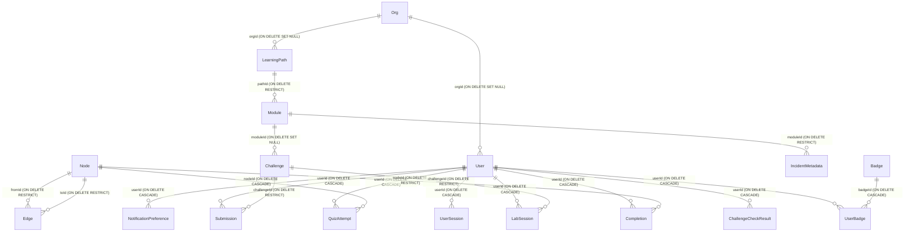

# SQL Schema Architecture

## 1. Corrections

No corrections to the prior three documents (`high_level_architecture.md`, `low_level_architecture.md`, `messaging.md`) were found. The prior documents accurately reflect the state of the shared schema and the tables involved.

---

## 2. Resolution of Shared-Schema Questions

**a. Sandbox-Worker Raw SQL Queries**
`sandbox-worker` executes raw SQL queries using the `sqlx` package, interacting with two tables: `Submission` and `ChallengeCheckResult`.

- **Queries Found**:
  - `UPDATE "Submission" SET status = $1 WHERE id = $2`
  - `UPDATE "Submission" SET status = $1, result = $2 WHERE id = $3`
  - `INSERT INTO "ChallengeCheckResult" ("userId", "challengeId", "checkId", status, message, "lastRunAt") ... ON CONFLICT ("userId", "challengeId", "checkId") DO UPDATE SET status = EXCLUDED.status, message = EXCLUDED.message, "lastRunAt" = NOW()`
- **Schema Validation**: The table and column names precisely match what Prisma generated (`schema.prisma`).
- **Type Mismatch/Risk**: In `sandbox-worker/internal/db/client.go`, the Go application passes plain string values (e.g., `"PENDING"`, `"PASSED"`) for the `$1` / `$4` parameters targeting the `status` columns. In Postgres, these columns are strictly typed as enums (`SubmissionStatus` and `CheckStatus`). The `pq` driver sends these as `text`, which Postgres will reject with a type mismatch error unless an explicit cast (e.g., `$1::"SubmissionStatus"`) is used. The raw SQL queries lack these casts.

**b. Implicit Coupling Through Shared Schema**
Because there is no schema-level separation, `sandbox-worker` implicitly relies on the foreign keys established by Node services:

- `Submission` and `ChallengeCheckResult` both have foreign keys to `User` (`userId`) and `Challenge` (`challengeId`).
- `sandbox-worker` does not own or manage these parent records. If `core-service` or `auth-service` deletes a `User` or `Challenge`, the `ON DELETE CASCADE` or `ON DELETE RESTRICT` constraints defined in the Prisma schema will affect `sandbox-worker`'s tables.
- This creates tight implicit coupling: `sandbox-worker` writes to tables whose lifecycle and referential integrity are bound to core business entities managed by other services.

**c. Migrations Ownership**
Migrations are owned centrally by a single shared Prisma setup inside `packages/db`. The `auth-service` and `core-service` both depend on the `@devops/db` package. There is no risk of independent services running conflicting migrations against the same database, as schema management is consolidated in this single library package rather than distributed per-service.

---

## 3. Full Table Inventory

_(All definitions exactly as declared in `packages/db/prisma/schema.prisma`)_

| Table                      | Columns                                                                                                                                                                                                                                                                                                                                                                                                                                                                                                                                                                                                                                                                                                                                                  | Read/Written By                              |
| -------------------------- | -------------------------------------------------------------------------------------------------------------------------------------------------------------------------------------------------------------------------------------------------------------------------------------------------------------------------------------------------------------------------------------------------------------------------------------------------------------------------------------------------------------------------------------------------------------------------------------------------------------------------------------------------------------------------------------------------------------------------------------------------------- | -------------------------------------------- |
| **Org**                    | `id` (String, PK, cuid)<br>`name` (String)<br>`planTier` (PlanTier enum, default FREE)<br>`seatsPurchased` (Int, default 1)<br>`createdAt` (DateTime, default now)<br>`updatedAt` (DateTime)                                                                                                                                                                                                                                                                                                                                                                                                                                                                                                                                                             |                                              |
| **User**                   | `id` (String, PK, cuid)<br>`name` (String?)<br>`email` (String, UNIQUE)<br>`password` (String?)<br>`role` (Role enum, default LEARNER)<br>`xp` (Int, default 0)<br>`orgId` (String?, FK to Org)<br>`onboardingState` (OnboardingState enum, default NEW)<br>`onboardingVersion` (Int, default 1)<br>`emailVerified` (DateTime?)<br>`githubId` (String?, UNIQUE)<br>`googleId` (String?, UNIQUE)<br>`mfaEnabled` (Boolean, default false)<br>`mfaSecret` (String?)<br>`avatarUrl` (String?)<br>`jobTitle` (String?)<br>`lastLoginAt` (DateTime?)<br>`firstLoginAt` (DateTime?)<br>`currentStreak` (Int, default 0)<br>`longestStreak` (Int, default 0)<br>`lastActivityDate` (DateTime?)<br>`createdAt` (DateTime, default now)<br>`updatedAt` (DateTime) | Read/Write: `auth-service`, `core-service`   |
| **Completion**             | `userId` (String, PK, FK to User)<br>`nodeId` (String, PK, FK to Node)<br>`createdAt` (DateTime, default now)                                                                                                                                                                                                                                                                                                                                                                                                                                                                                                                                                                                                                                            | Read/Write: `core-service`                   |
| **Challenge**              | `id` (String, PK, cuid)<br>`title` (String)<br>`description` (String)<br>`difficulty` (Difficulty enum)<br>`category` (Category enum)<br>`tags` (String[])<br>`xp` (Int)<br>`dockerImage` (String)<br>`templateCode` (String?)<br>`editorLanguage` (String, default 'plaintext')<br>`moduleId` (String?, FK to Module)<br>`createdAt` (DateTime, default now)<br>`updatedAt` (DateTime)                                                                                                                                                                                                                                                                                                                                                                  | Read: `core-service`                         |
| **LabSession**             | `id` (String, PK, cuid)<br>`userId` (String, FK to User)<br>`challengeId` (String, FK to Challenge)<br>`status` (SessionStatus enum, default ACTIVE)<br>`startedAt` (DateTime, default now)<br>`endedAt` (DateTime?)                                                                                                                                                                                                                                                                                                                                                                                                                                                                                                                                     | Read/Write: `core-service`                   |
| **LearningPath**           | `id` (String, PK, cuid)<br>`title` (String)<br>`description` (String)<br>`slug` (String, UNIQUE)<br>`orgId` (String?, FK to Org)<br>`createdAt` (DateTime, default now)<br>`updatedAt` (DateTime)                                                                                                                                                                                                                                                                                                                                                                                                                                                                                                                                                        |                                              |
| **Module**                 | `id` (String, PK, cuid)<br>`title` (String)<br>`description` (String)<br>`order` (Int)<br>`pathId` (String, FK to LearningPath)<br>`createdAt` (DateTime, default now)<br>`updatedAt` (DateTime)                                                                                                                                                                                                                                                                                                                                                                                                                                                                                                                                                         |                                              |
| **IncidentMetadata**       | `id` (String, PK, cuid)<br>`title` (String)<br>`description` (String)<br>`scenario` (String)<br>`postMortem` (String)<br>`difficulty` (Difficulty enum)<br>`xp` (Int)<br>`moduleId` (String, FK to Module)<br>`createdAt` (DateTime, default now)<br>`updatedAt` (DateTime)                                                                                                                                                                                                                                                                                                                                                                                                                                                                              |                                              |
| **Submission**             | `id` (String, PK, cuid)<br>`code` (String)<br>`status` (SubmissionStatus enum, default PENDING)<br>`result` (Json?)<br>`userId` (String, FK to User)<br>`challengeId` (String, FK to Challenge)<br>`createdAt` (DateTime, default now)                                                                                                                                                                                                                                                                                                                                                                                                                                                                                                                   | Read/Write: `core-service`, `sandbox-worker` |
| **Node**                   | `id` (String, PK, cuid)<br>`type` (NodeType enum)<br>`title` (String)<br>`description` (String)<br>`metadata` (Json?)<br>`createdAt` (DateTime, default now)                                                                                                                                                                                                                                                                                                                                                                                                                                                                                                                                                                                             | Read/Write: `core-service`                   |
| **QuizAttempt**            | `id` (String, PK, cuid)<br>`userId` (String, FK to User)<br>`nodeId` (String, FK to Node)<br>`score` (Int)<br>`total` (Int)<br>`passed` (Boolean)<br>`createdAt` (DateTime, default now)                                                                                                                                                                                                                                                                                                                                                                                                                                                                                                                                                                 | Write: `core-service`                        |
| **Edge**                   | `fromId` (String, PK, FK to Node)<br>`toId` (String, PK, FK to Node)                                                                                                                                                                                                                                                                                                                                                                                                                                                                                                                                                                                                                                                                                     | Read: `core-service`                         |
| **SecurityLog**            | `id` (String, PK, cuid)<br>`userId` (String?)<br>`action` (String)<br>`ip` (String?)<br>`userAgent` (String?)<br>`metadata` (Json?)<br>`createdAt` (DateTime, default now)                                                                                                                                                                                                                                                                                                                                                                                                                                                                                                                                                                               | Write: `auth-service`                        |
| **OutboxEvent**            | `id` (String, PK, cuid)<br>`eventType` (String)<br>`payload` (Json)<br>`processed` (Boolean, default false)<br>`createdAt` (DateTime, default now)                                                                                                                                                                                                                                                                                                                                                                                                                                                                                                                                                                                                       | Read/Write: `auth-service`, `core-service`   |
| **ChallengeCheckResult**   | `id` (String, PK, cuid)<br>`userId` (String, FK to User)<br>`challengeId` (String, FK to Challenge)<br>`checkId` (String)<br>`status` (CheckStatus enum)<br>`message` (String, default '')<br>`lastRunAt` (DateTime, default now)                                                                                                                                                                                                                                                                                                                                                                                                                                                                                                                        | Write: `sandbox-worker`                      |
| **UserSession**            | `id` (String, PK, cuid)<br>`userId` (String, FK to User)<br>`userAgent` (String?)<br>`ip` (String?)<br>`createdAt` (DateTime, default now)<br>`lastSeenAt` (DateTime, default now)<br>`revokedAt` (DateTime?)                                                                                                                                                                                                                                                                                                                                                                                                                                                                                                                                            | Read/Write: `auth-service`                   |
| **Badge**                  | `id` (String, PK, cuid)<br>`slug` (String, UNIQUE)<br>`title` (String)<br>`description` (String)<br>`iconRef` (String)<br>`roadmapId` (String?)                                                                                                                                                                                                                                                                                                                                                                                                                                                                                                                                                                                                          | Read: `core-service`                         |
| **UserBadge**              | `userId` (String, PK, FK to User)<br>`badgeId` (String, PK, FK to Badge)<br>`earnedAt` (DateTime, default now)                                                                                                                                                                                                                                                                                                                                                                                                                                                                                                                                                                                                                                           | Read/Write: `core-service`                   |
| **NotificationPreference** | `userId` (String, PK, FK to User)<br>`weeklyDigest` (Boolean, default true)<br>`productUpdates` (Boolean, default true)<br>`challengeReminders` (Boolean, default true)                                                                                                                                                                                                                                                                                                                                                                                                                                                                                                                                                                                  | Read/Write: `core-service`                   |

---

## 4. Entity Relationship Map

Relationships and cascade behaviors based directly on `schema.prisma` foreign keys.



---

## 5. The OutboxEvent Table

**Schema Definition**:

```prisma
model OutboxEvent {
  id        String   @id @default(cuid())
  eventType String
  payload   Json
  processed Boolean  @default(false)
  createdAt DateTime @default(now())

  @@index([processed, createdAt])
}
```

- **Indexes**: There is a specific composite index on `(processed, createdAt)` (`OutboxEvent_processed_createdAt_idx`), perfectly optimized for the `findMany` poller query (`WHERE processed = false ORDER BY createdAt ASC`).
- **Shared Usage**: This table is actively shared and written to by _both_ `auth-service` and `core-service`. Both services depend on the `@devops/db` Prisma package and insert records into this single `public."OutboxEvent"` table in Postgres.

---

## 6. Enums and Check Constraints

**Postgres Enums** (Declared in schema):

- `PlanTier`: 'FREE', 'PRO', 'TEAM'
- `SessionStatus`: 'ACTIVE', 'COMPLETED', 'EXPIRED', 'TERMINATED'
- `NodeType`: 'CONCEPT', 'SCENARIO', 'QUIZ'
- `Role`: 'GUEST', 'LEARNER', 'CONTRIBUTOR', 'ADMIN'
- `Difficulty`: 'JUNIOR', 'MID', 'SENIOR'
- `Category`: 'KUBERNETES', 'DOCKER', 'CICD', 'TERRAFORM', 'BASH', 'SECURITY', 'MONITORING'
- `SubmissionStatus`: 'PENDING', 'RUNNING', 'COMPLETED', 'FAILED'
- `OnboardingState`: 'NEW', 'TOUR_DISMISSED', 'TOUR_COMPLETED'
- `CheckStatus`: 'PASSED', 'FAILED'

**Check Constraints**:

- No `CHECK` constraints exist in the `schema.prisma`.

**Application-Level Mapping Mismatches**:

- `sandbox-worker` (Go) defines constants for `SubmissionStatus` (`"PENDING"`, `"RUNNING"`, `"COMPLETED"`, `"FAILED"`) and directly assigns `"PASSED"`/`"FAILED"` for `CheckStatus`. While the string values match the enum values perfectly, the Go raw SQL uses them as untyped strings in queries (`$1`), rather than explicitly casting them to Postgres enums (e.g. `$1::"CheckStatus"`).

---

## 7. Indexes and Known Query Patterns

- **LabSession Concurrency Check**:
  - **Query Pattern**: The concurrency check counts active sessions for a user.
  - **Supporting Index**: An index exists precisely for this pattern: `@@index([userId, status])` (`LabSession_userId_status_idx`). It avoids a sequential scan when querying active sessions for a specific user.
- **OutboxEvent Polling**:
  - **Query Pattern**: The outbox poller queries for pending events ordered by creation time: `WHERE processed = false ORDER BY createdAt ASC`.
  - **Supporting Index**: An index exists precisely for this pattern: `@@index([processed, createdAt])` (`OutboxEvent_processed_createdAt_idx`).

---

## 8. Multi-Tenancy / Row-Scoping Reality Check

**Proposed But Not Yet Implemented (Fully)**:
While previous documentation may describe a comprehensive `org_id`-based tenancy model, the current database schema implements it only partially:

- `orgId` exists on the `User` table (mapping users to an organization).
- `orgId` exists on the `LearningPath` table.
- **However**, core entities like `LabSession`, `Challenge`, `Module`, `Submission`, and `Node` **do not have an `orgId` column**. Row-level scoping for these entities is not physically enforced at the schema level and must be managed via relationship traversals in application logic (e.g., User -> Org).

---

## 9. Open Questions / Unverified

- **Enum Type Casting in sqlx**: Will the raw SQL queries in `sandbox-worker` fail at runtime due to passing text strings into strict Postgres enum columns? Typically `lib/pq` requires an explicit `::"EnumName"` cast in the SQL string, which is currently missing in `internal/db/client.go`.
- **Cross-Service Outbox Polling**: Since `OutboxEvent` is a single shared table, do the separate outbox pollers in `auth-service` and `core-service` inadvertently pick up each other's events? If they do not filter by `eventType`, `core-service` could attempt to publish an `auth-service` event to Kafka.
